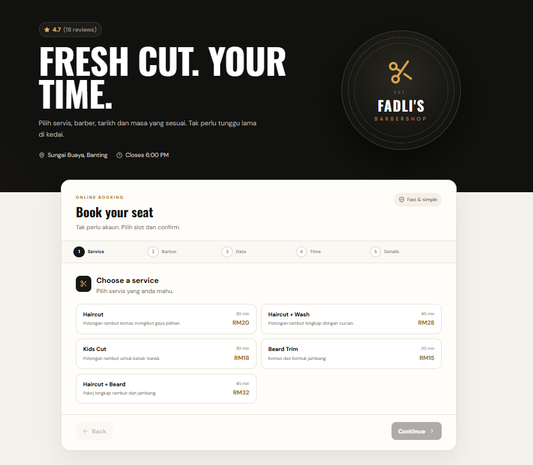
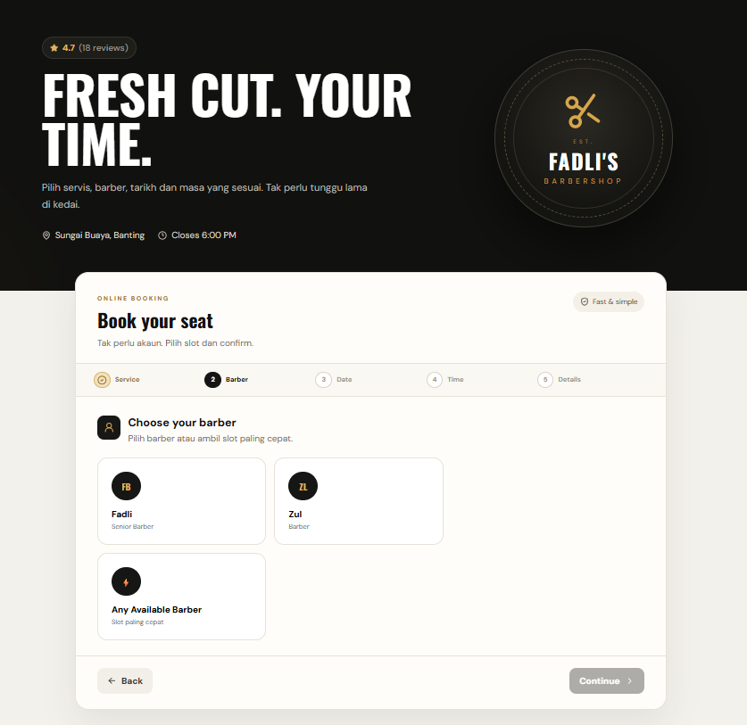
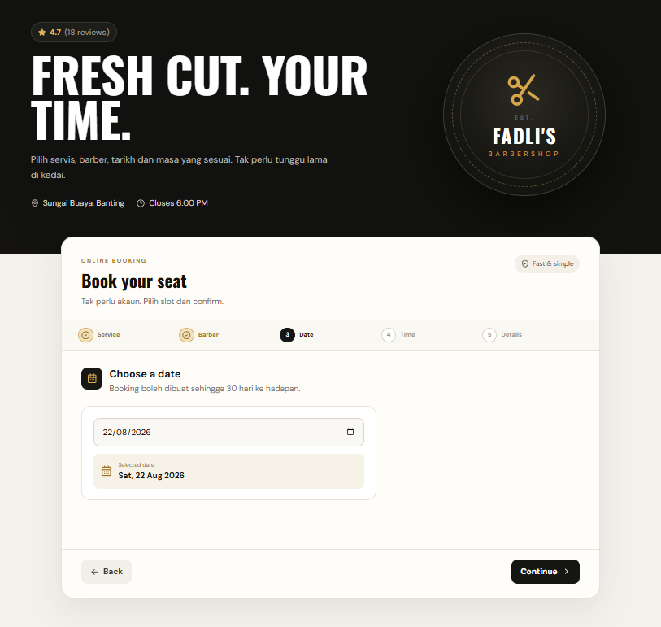
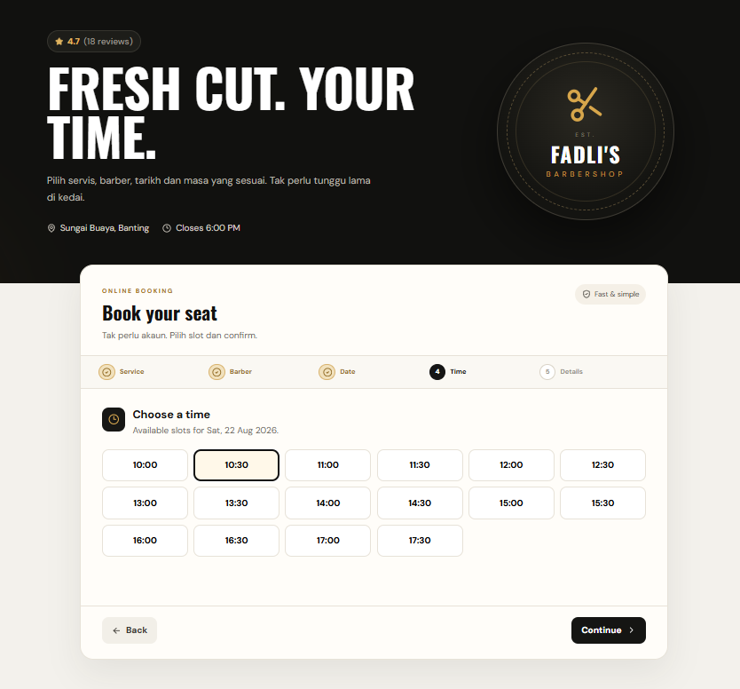
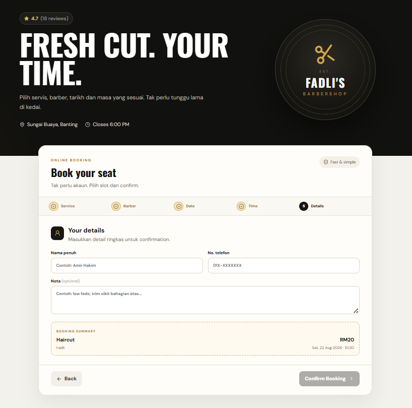
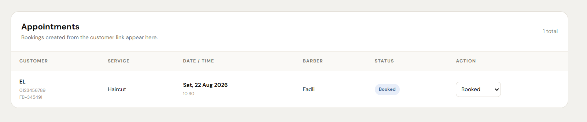
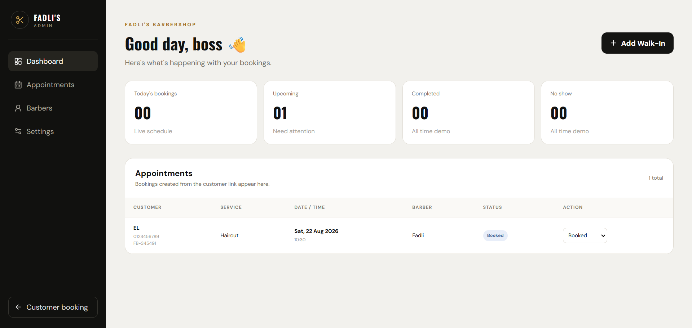

# Custom Booking & Scheduling System

### Service Business Booking Platform

A responsive booking workflow designed for service businesses that need structured staff selection, slot availability, appointment scheduling, and admin management.

 

 

**Service Selection · Staff Availability · Time Slots · Appointment Management**

---

## Overview

This portfolio showcases a demo version of a custom booking and scheduling system originally developed around a real service-business workflow.

The platform is designed to make appointment booking simpler for customers while giving staff a centralized way to manage schedules and appointments.

> This repository showcases selected customer and administrative workflows. Production-specific information and sensitive business data are not included.

---

## The Booking Problem

Service businesses often manage appointments manually through calls, messaging apps, or informal calendars.

This can create issues such as:

| Problem | Impact |
|---|---|
| Manual appointment coordination | More back-and-forth with customers |
| Unclear staff availability | Risk of scheduling conflicts |
| Scattered booking records | Difficult appointment management |
| Repeated confirmation messages | More administrative work |
| No centralized view | Harder to monitor daily schedules |

The goal was to create a structured booking flow that is simple for both customers and administrators.

---

## Customer Booking Flow

**Choose Service**  
↓  
**Choose Staff**  
↓  
**Select Date**  
↓  
**View Available Time Slots**  
↓  
**Enter Customer Details**  
↓  
**Confirm Booking**

The customer interface guides users through each decision rather than presenting one large booking form.

---

# Interface Highlights

## Service Selection

Customers begin by selecting the service they want to book.

---

## Staff Selection

Customers can select the staff member or service provider they prefer.

---

## Date Selection

Calendar-based scheduling allows customers to choose an available booking date.

---

## Time Slot Selection

Available appointment times are displayed based on the selected staff member and date.

---

## Booking Confirmation

The final booking step summarizes appointment information before confirmation.

---

## Admin Appointments

Centralized appointment management for reviewing bookings and updating appointment status.

---

## Admin Dashboard

Administrative overview for monitoring booking activity and managing the service schedule.

---

## Staff-Specific Slot Logic

One of the important scheduling rules is that booking availability is handled per staff member.

For example:

- Staff A can be booked at 11:00 AM
- Staff B can also be booked at 11:00 AM
- The system only blocks the slot for the staff member who already has an appointment

This prevents unnecessary global slot blocking while keeping individual staff schedules accurate.

---

## Booking Logic

| Step | System Behaviour |
|---|---|
| Service | Customer selects required service |
| Staff | Booking is scoped to the selected staff member |
| Date | System checks the selected day |
| Time | Only relevant available slots are displayed |
| Customer | Booking details are recorded |
| Confirmation | Appointment information is confirmed |
| Admin | Booking appears in the management workflow |

---

## Admin Workflow

The administrative side provides a centralized area for managing appointments.

Typical actions include:

- View upcoming appointments
- Review customer booking details
- Monitor staff schedules
- Update booking status
- Manage appointment flow
- View daily booking activity

This reduces reliance on separate messages or manually maintained appointment lists.

---

## Designed for Service Businesses

The booking structure can be adapted for businesses such as:

- Barbershops
- Salons
- Repair appointments
- Consultation services
- Training sessions
- Clinics
- Professional services
- Other appointment-based businesses

The workflow is designed to be configurable around the business rather than tied to one specific industry.

---

## Design Approach

### Simple Booking

The customer should only see the information needed at each stage.

### Staff-Aware Scheduling

Availability is calculated around individual staff schedules rather than one shared global timetable.

### Clear Administration

Appointments are brought into one centralized management view.

### Responsive Experience

The interface is designed to remain usable across desktop and mobile devices.

### Adaptable Workflow

Services, staff, time slots, and administrative flows can be adjusted for different service businesses.

---

## Project Status

🟢 **Functional Demo**

This case study presents a working demonstration of selected customer and administrative booking features.

The original workflow was developed around a service-based business, while the portfolio version demonstrates how the same system structure can be adapted for other appointment-based operations.

---

## Source Code

🔒 **Private / Portfolio Demo**

The full production implementation is not publicly available.

This repository exists to showcase selected:

- Booking workflows
- Scheduling logic
- Staff availability handling
- Customer experience
- Admin appointment management
- Responsive interface design

---

## Krafinity Services

**Custom Business Systems · Web Applications · Digital Solutions**

Built around real business workflows.

